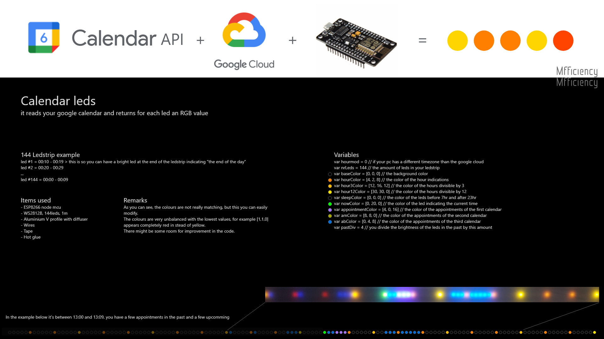

# CalendarLeds

Get your google calendar into an individual adressable LED strip.

It reads your google calendar and returns for each led an RGB value.

144 Ledstrip example
led #1 = 00:10 - 00:19 > this is so you can have a bright led at the end of the ledstrip indicating "the end of the day"
led #2 = 00:20 - 00:29
...
led #144 = 00:00 - 00:09 

Items used:
- ESP8266 node mcu V3
- WS2812B, 144leds, 1m
- Aluminium V profile with diffuser
- Wires
- Tape
- Hot glue

Resources:
- calendar api tutorial: https://www.youtube.com/watch?v=zrLf4KMs71E

common issues:
- first led is flickering
- rest of the strip is sometimes gosting/flickering
